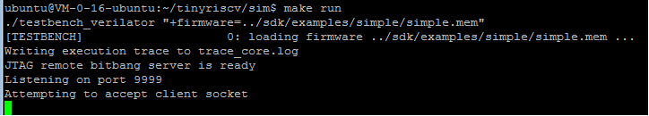
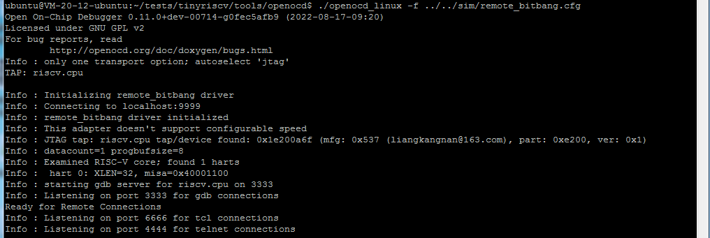
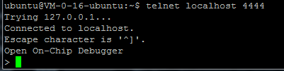
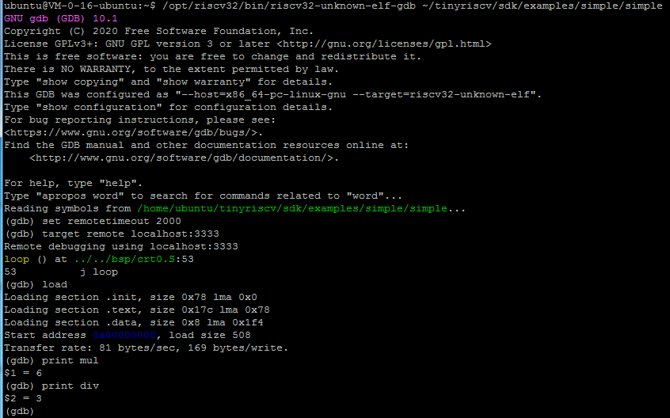

# 1.概述

本分支是在bram分支的基础上进行改进的。

改进的地方主要有：

1. 开发环境切换到Linux(Ubuntu18.04)系统下；
2. 仿真器使用verilator；
3. 内部总线使用OBI总线(详细内容见doc/OBI-v1.0.pdf文档)；
4. 增加指令trace功能；
6. JTAG模块全面改进和优化，支持3个硬件断点，单步等功能，支持gdb调试；
7. 增加静态分支预测功能；

# 2.使用方法

## 2.1安装gcc工具链

下载gcc工具链([百度云链接](https://pan.baidu.com/s/1iRiZoPnt9M1upXsUkvLEfA)，提取码：yaib)，使用下面的命令解压到/opt/riscv32目录下：

```
sudo tar zxf tinyriscv-gcc-toolchain.tar.gz -C /
```

## 2.2下载代码

下载本项目verilator分支的代码：

```
git clone -b verilator https://gitee.com/liangkangnan/tinyriscv.git
```

## 2.3运行仿真

打开终端，进入到sim目录下，执行以下的命令编译：

```
make recompile
```

这个命令会重新编译整个rtl源码和sdk/examples/simple这个C语言例程。如果需要使用其他例程，可以用PROG参数指定，比如：

```
make PROG=/path/sdk/examples/hello_world/hello_world.mem recompile
```

执行以下命令运行仿真：

```
make run
```



打开另一个终端，进入到tools/openocd目录下，运行openocd：

```
./openocd_linux -f ../../sim/remote_bitbang.cfg
```



可以看到openocd已经连上了，可以使用telnet或者gdb进行调试了。

### 2.3.1使用telnet进行调试

再打开另一个终端，输入以下命令连接telnet：

```
telnet localhost 4444
```



然后就可以使用各种命令进行调试了。下面介绍一些常用的命令：

**halt**：停住MCU，进入调试模式；

**resume**：MCU从停住的地方继续执行，退出调试模式；

**reset**：复位MCU，复位之后就开始执行。通常在下载完程序后使用该命令来运行程序；

**reset halt**：复位MCU，然后停住MCU，即MCU停在复位地址处；

**bp 0x00000010 4 hw**：打断点，其中0x00000010是断点的地址，4表示地址长度为4个字节，hw表示硬件断点。tinyriscv只支持硬件断点。

**rbp 0x00000010**：删除0x00000010地址处的断点；

**bp**：查看所有断点信息；

**step**：单步执行，每次执行一条指令；

**mww 0x00000010 0x1234**：即memory write word，往0x00000010地址处写入0x1234，长度为4个字节；

**mdw 0x00000010 2**：即memory display word，从0x00000010地址处读取2个word；

**reg sp**：读取sp寄存器的值；

**reg sp 0x10**：往sp寄存器写入0x10；

**load_image**：加载image文件，比如：load_image filename address bin min_address max_length，其中filename表示要加载的文件，address表示要加载到哪个地址，bin表示文件的类型，min_address表示最小地址，该值与address相同即可，max_length表示文件的最大长度。目前使用这个命令来下载C语言程序。

**verify_image**：比如：verify_image filename offset，其中filename表示已经下载了的文件，offset表示从哪个地址开始校验。使用这个命令来校验下载进去的程序是否正确。

**load_bin**：如果觉得load_image命令的参数比较多，可以使用load_bin命令，比如：load_bin bin_file 0x0 1，表示将bin_file二进制文件下载到0x0地址处，并且校验。

### 2.3.2使用gdb进行调试

除了使用telnet进行调试之外，还可以使用gdb进行调试，这也是大部分IDE（eclipse等）所使用的调试方式。

openocd连上之后，打开另一个终端，执行以下命令运行gdb：

```
/opt/riscv32/bin/riscv32-unknown-elf-gdb ~/tinyriscv/sdk/examples/simple/simple
```

接着，设置一下超时时间：

```
set remotetimeout 2000
```

连接openocd服务：

```
target remote localhost:3333
```

加载程序：

```
load
```

之后就可以用gdb命令来调试了，比如打印mul变量的值：

```
print mul
```



注意，如果要用gdb进行调试，则编译C程序时必须加上-g参数。

